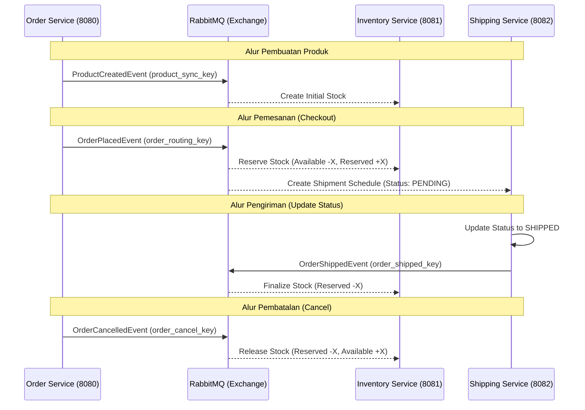

# Dokumentasi Arsitektur & Relasi Microservices

## 1. Ringkasan Sistem

Sistem ini adalah platform **Order Management** berbasis microservices yang menggunakan pendekatan **Event-Driven Architecture (EDA)**. Terdiri dari tiga service utama: `order-management`, `inventory-service`, dan `shipping-service` yang berkomunikasi secara asinkron melalui **RabbitMQ**.

## 2. Alasan Desain (Design Rationale)

* **Loose Coupling**: Setiap service berdiri sendiri dengan database masing-masing. Perubahan pada satu service tidak merusak service lainnya.
* **Scalability**: Jika transaksi melonjak, kita bisa menambah instance `inventory-service` tanpa harus menyentuh service order.
* **Reliability (RabbitMQ)**: Menggunakan antrean pesan menjamin data tetap terproses meskipun salah satu service sedang down sesaat.
* **Data Integrity (Reserve/Finalize)**: Desain stok dua tahap (`available` vs `reserved`) mencegah *overselling* dan memudahkan proses pembatalan pesanan.

## 3. Relasi Order - Inventory - Shipping

* [ ] Relasi antar service dipicu oleh **Event** yang dikirim ke RabbitMQ:

1. **Order -> Inventory (Sync Produk)**: Saat produk baru dibuat, Inventory membuat baris stok awal.
2. **Order -> Inventory (Reserve)**: Saat pesanan dibuat, stok dipindahkan dari `available` ke `reserved` (dikunci).
3. **Order -> Shipping (Schedule)**: Saat pesanan dibuat, jadwal pengiriman otomatis dibuat dengan status `PENDING`.
4. **Order -> Inventory (Release)**: Jika pesanan dibatalkan, stok `reserved` dikembalikan ke `available`.
5. **Shipping -> Inventory (Finalize)**: Saat status pengiriman menjadi `SHIPPED`, stok `reserved` dihapus (barang dianggap keluar dari gudang).

## 4. Diagram Relasi

## 5. Hubungan Database

| Service                     | Database                | Tabel Utama                                             |
| :-------------------------- | :---------------------- | :------------------------------------------------------ |
| **Order Management**  | `order_management_db` | `products`, `orders`, `customers`, `categories` |
| **Inventory Service** | `inventory_db`        | `inventories` (Mapping: `product_id`)               |
| **Shipping Service**  | `shipping_db`         | `shipments` (Mapping: `order_id`)                   |
